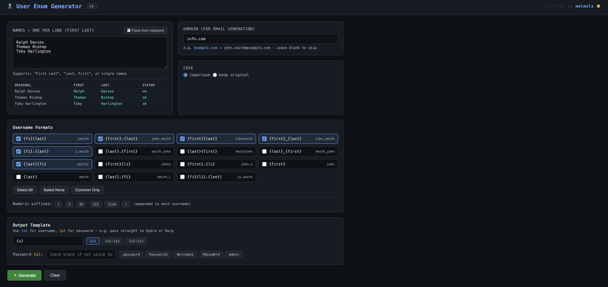
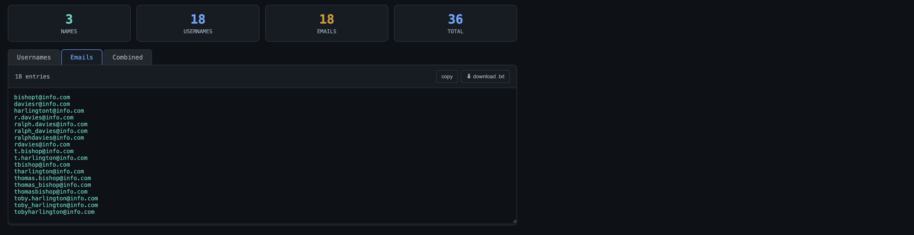

# UserEnumGen - Username Wordlist Generator

A browser-based tool for generating username wordlists from a list of real names, for use in penetration testing and CTF challenges.




**Author:** melmols

## Requirements

Any modern browser (Chrome, Firefox, Edge, Safari). No install, no server, no internet connection required.

## Installation
- git clone https://github.com/melmols/UserEnumGen
- cd `UsGen`
- open `usgen.html`

## Features

- **15 username formats:** covers the most common AD/corporate conventions (`jsmith`, `john.smith`, `john_smith`, `smithj`, etc.)
- **Email generation:** optionally supply a domain to generate email addresses alongside usernames
- **Numeric suffixes:** append common suffixes (`1`, `01`, `123`, `!`, etc.) to every username
- **Output template:** format output as `{u}`, `{u}:{p}`, or any custom pattern. Pipe straight into Hydra or Burp
- **Collision detection:** flags usernames that map to more than one person in the input list
- **Live name preview:** parses names as you type and shows how first/last will be split before generating
- **Case control:** output lowercase or preserve original casing
- **Password wordlist generator:** builds a spray list from names, domain/company, custom keywords (org name, location, project), seasonal patterns, and common corporate passwords — with configurable year suffixes
- **Four output tabs:** Usernames, Emails, Combined, Passwords — each with copy and `.txt` download

## Supported Username Formats

`{fi}` = first initial, `{li}` = last initial

| Format | Example |
|--------|---------|
| `{fi}{last}` | jsmith |
| `{first}.{last}` | john.smith |
| `{first}{last}` | johnsmith |
| `{first}_{last}` | john_smith |
| `{fi}.{last}` | j.smith |
| `{last}{fi}` | smithj |
| `{last}.{first}` | smith.john |
| `{last}{first}` | smithjohn |
| `{last}_{first}` | smith_john |
| `{first}{li}` | johns |
| `{first}.{li}` | john.s |
| `{last}.{fi}` | smith.j |
| `{fi}{li}.{last}` | js.smith |
| `{first}` | john |
| `{last}` | smith |

## Usage

1. Open `usgen.html` in a browser. Works fully offline.
2. Paste names (one per line) into the input box. Supports:
   - `First Last` (e.g. `John Smith`)
   - `Last, First` (e.g. `Smith, John`)
   - Single names
3. Optionally enter a domain for email generation (e.g. `example.com`).
4. Select username formats and any numeric suffixes.
5. Set an output template if needed (e.g. `{u}:{p}` for credential pairs).
6. Optionally enable **Password Wordlist** and select categories (Names, Company, Custom Keywords, Seasonal, Common Corporate) and years.
7. Click **Generate**.
8. Use the **Usernames**, **Emails**, **Combined**, or **Passwords** tabs to copy or download the wordlist.

## Example Workflow

Scrape employee names from LinkedIn or the company website, paste them in, then feed the output straight into a spray tool:

```bash
# username enumeration
kerbrute userenum --dc 10.10.10.10 -d example.com usernames.txt

# password spray
hydra -L usernames.txt -p Password1 smb://10.10.10.10
```

## Privacy

All processing is done client-side in JavaScript. No data is sent anywhere.
